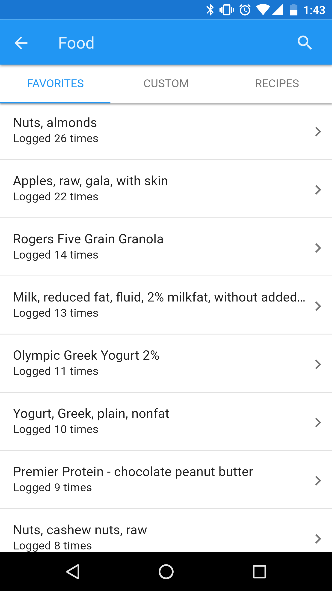

# Diet App

> A nutrition app.



## Build Setup

``` bash
# install dependencies
npm install

# serve with hot reload at localhost:8080
npm run dev

# build for production with minification
npm run build

# run unit tests
npm run unit

# run e2e tests
npm run e2e

# run all tests
npm test
```

For detailed explanation on how things work, checkout the [guide](http://vuejs-templates.github.io/webpack/) and [docs for vue-loader](http://vuejs.github.io/vue-loader).

## Cordova builds

``` bash
# Install Cordova
sudo npm install -g cordova

# For ios builds, install XCode, then the ios sim.
sudo npm install -g ios-sim
cordova platform add ios

# For android builds, install the Android SDK, then create a new Virtual Device.
# https://developer.android.com/studio/run/managing-avds.html
cordova platform add android

# Run on emulator
cordova run ios --emulator
cordova run android --emulator

# Run on connected device
cordova run ios --device
cordova run android --device
```